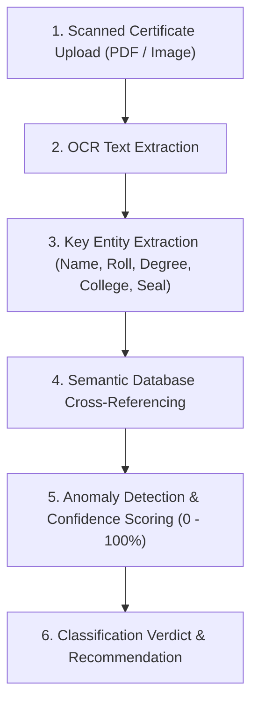

# AI Architecture & Modules

The platform features two core AI integrations:
1. **AI Document Verification Agent** (Automated OCR Entity Extractor & Institutional Cross-Checker)
2. **DocumentAssist AI Navigation Chatbot** (Context-Aware Intent Engine & Deep-Link Dispatcher)

---

## 1. AI Document Verification Agent

### 6-Step Verification Pipeline

### Classification Verdicts
- 🟢 **CONSISTENT (Score >= 85%)**: All critical fields (Candidate Name, Roll Number, Program, Institution) match database records without discrepancy.
- 🟡 **NEEDS MANUAL REVIEW (Score 55% - 84%)**: Minor spelling variance, partial token matches, or low OCR scan quality on secondary marks. College Admin manual review required.
- 🔴 **SUSPICIOUS / MISMATCH (Score < 55%)**: Critical mismatch detected on Student Name, Roll Number, or Issuing College. Flagged for fraud prevention.

### Institutional Disclaimer
> **IMPORTANT**: The AI Document Verification Agent assists authorized institutions with automated extraction and cross-referencing. The AI does **NOT** claim absolute guarantee of authenticity; final verification authority remains exclusively with the issuing institution.

---

## 2. DocumentAssist AI Chatbot

### Operational Modes
1. **Mode 1 — Clickable Suggested Questions**: Pre-configured query chips covering onboarding, certificate retrieval, verification explanations, and college contact procedures.
2. **Mode 2 — Natural Language User Queries**: Parses user intent using normalized semantic matching and personal context (e.g. document counts for authenticated students).

### Deep-Linking Navigation Engine
When queries express navigation intent (e.g. *"Where can I see my pending requests?"* or *"Where to upload certificates?"*), DocumentAssist AI returns action buttons that navigate the user directly to the appropriate page.
